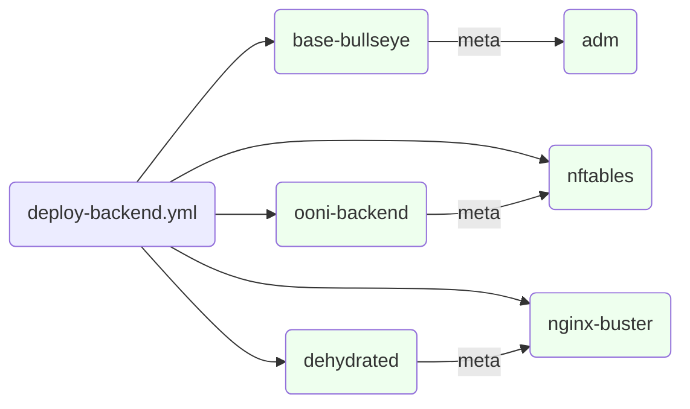
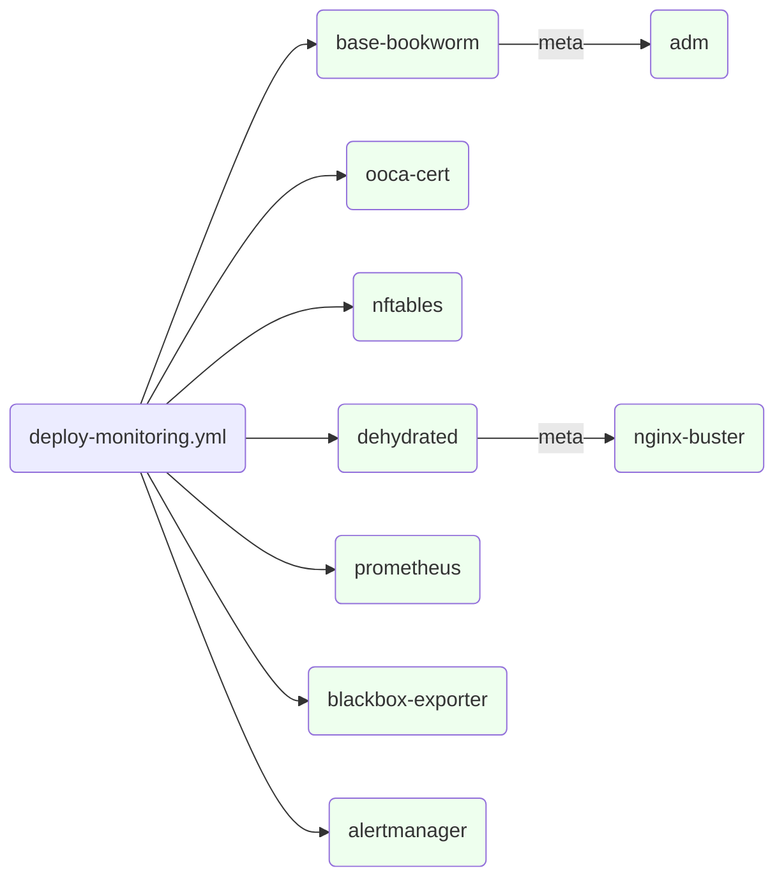

# Ansible

**NOTE** We are currently in the process of migrating ansible configurations from [ooni/sysadmin](https://github.com/ooni/sysadmin) to [ooni/devops](https://github.com/ooni/devops).

Ansible is used to configure the OSes on long term provisioned backend hosts and manage the configuration for these components.

For example ansible will be used to configure the setup of VPSs and dedicated hosts that are provisioned manually or using terraform.

In the case of hosts that are continously delivered, we instead use cloud-native configuration management tools.

## Installation and setup

It's recommended to make use of a virtualenv, for example managed using `pyenv virtualenv`:
```
pyenv virtualenv ooni-devops
pyenv activate ooni-devops
```

### Ansible setup

You should then install the required python and ansible-galaxy depedencies with:
```
pip install -r requirements/python.yml
ansible-galaxy install -r requirements/ansible-galaxy.yml
```

In order to gain access to machines you will have to add your public key to the
`ssh_users` variable inside of `ansible/group_vars/all/vars.yml`.

It's recommended you generate an `ed25519` key using the following command:
```
ssh-keygen -t ed25519 -f ~/.ssh/id_ed25519_ooni
```

**Attention** Be sure to set a strong password on your ssh key and to never store it on disk in plaintext.

You can check to see if your ssh key is being stored encrypted by running:
```
ssh-keygen -yf ~/.ssh/id_ed25519_ooni
```
and checking you get back an `Enter passphrase` prompt

### AWS configuration

Refer to the [terraform docs](devops/terraform/) for setting up your AWS configuration.

### SSH configuration

You should configure your `~/.ssh/config` with the following:

```
    IdentitiesOnly yes
    ServerAliveInterval 120
    UserKnownHostsFile ~/.ssh/known_hosts ~/REPLACE_ME/sysadmin/ext/known_hosts

    host *.ooni.io
      user YOUR_USERNAME

    host *.ooni.nu
      user YOUR_USERNAME

    host *.ooni.org
      user YOUR_USERNAME
```

**TODO** restore ext/known_hosts setup

Replace `~/REPLACE_ME/sysadmin/ext/known_hosts` to where you have cloned
the `ooni/sysadmin` repo. This will ensure you use the host key
fingeprints from this repo instead of just relying on TOFU.

You should replace `YOUR_USERNAME` with your username from `adm_login`.

On MacOS you may want to also add:

    host *
        UseKeychain yes

To use the Keychain to store passwords.

## Running ansible playbooks

Playbooks are run via an wrapper script called `./play` which notifies the slack #ooni-bots channel that a deployment has been triggered.

```
./play -i inventory deploy-<component>.yml -l <hostname> --diff -C
./play -i inventory deploy-<component>.yml -l <hostname> --diff
```

:::caution
any minor error in configuration files or ansible's playbooks can be
destructive for the backend infrastructure. Always test-run playbooks
with `--diff` and `-C` at first and carefully verify configuration
changes. After verification run the playbook without `-C` and verify
again the applied changes.
:::

:::note
[Etckeeper](#etckeeper)&thinsp;🔧 can be useful to verify configuration
changes from a different point of view.
:::

In general there are two classes of playbooks:
* Those starting with `deploy-*.yml`, which are used to deploy specific components or pieces of components related to OONI infrastructure. All of these playbooks are included inside of `playbook.yml` to faciliate testing and ensuring that every component in our infrastucture is fully deployable.
* Those starting with `playbook-*` which are playbooks for specific tasks that may not be part of the main infrastructure deployment (eg. bootstrapping nodes once upon creation, creating snapshots of remote configurations, etc.)

Some notable playbooks or roles are:

The bootstrap playbook is in `playbook-bootstrap.yml` and is a playbook that should be run once when a new host is created.

The nftables firewall is configured to read every `.nft` file under
`/etc/ooni/nftables/` and `/etc/ooni/nftables/`. This allows roles to
create small files to open a port each and keep the configuration as
close as possible to the ansible step that deploys a service. See this in use inside of the `nftables` role.

#### The root account

Runbooks use ssh to log on the hosts using your own account and leveraging `sudo` to act as root.

The only exception is when a new host is being deployed - in that case ansible will log in as root to create
individual accounts and lock out the root user.

When running the entire runbook ansible might try to run it as root.
This can be avoided by selecting only the required tags using `-t <tagname>`.

Ideally the root user should be disabled after succesfully creating user accounts.

#### Roles layout

Ansible playbooks use multiple roles (see
[example](https://github.com/ooni/sysadmin/blob/master/ansible/deploy-backend.yml#L46))
to deploy various components.

Few roles use the `meta/main.yml` file to depend on other roles. See
[example](https://github.com/ooni/sysadmin/blob/master/ansible/roles/ooni-backend/meta/main.yml)

:::note
The latter method should be used sparingly because ansible does not
indicate where each task in a playbook is coming from. Moreover if a dependencies is specified twice inside of two roles, it will run twice.
:::

A diagram of the role dependencies for the deploy-backend.yml playbook:



A similar diagram for deploy-monitoring.yml:



:::note
When deploying files or updating files already existing on the hosts it can be useful to add a note e.g. "Deployed by ansible, see <role_name>".
This helps track down how files on the host were modified and why.
:::

### Platform specific known bugs

On macOS you might run into this issue: https://github.com/ansible/ansible/issues/76322

The current workaround is to export the following environment variable before running ansible:
```
export OBJC_DISABLE_INITIALIZE_FORK_SAFETY=YES
```
