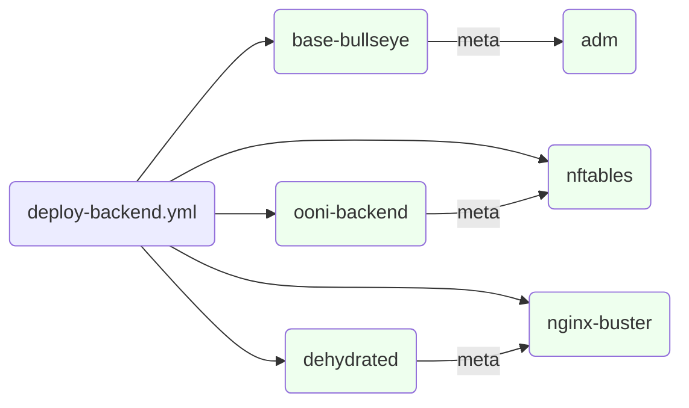
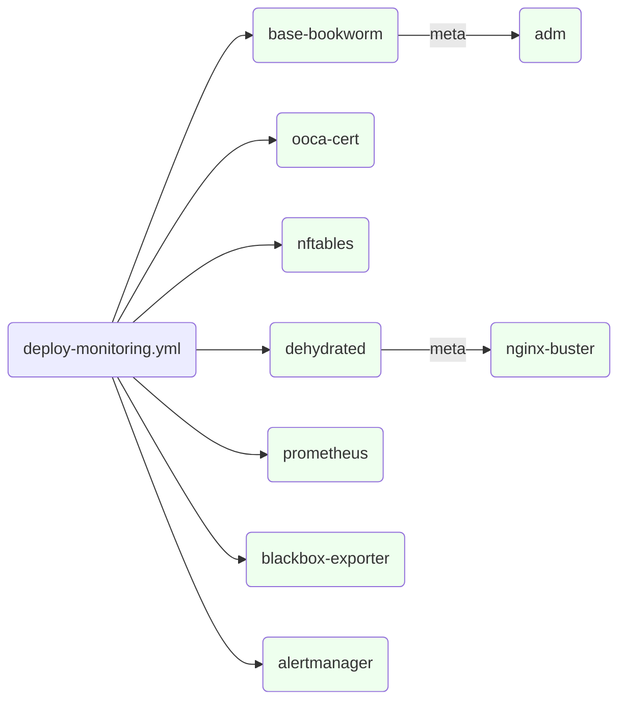

# Infrastructure

Our infrastructure is primarily spread across the following providers:

* Hetzner, for dedicated hosts
* DigitalOcean, for VPSs which require IPv6 support
* AWS, for most cloud based infrastrucutre hosting

We manage the deployment and configuration of hosts through a combination of ansible and terraform.

### Hosts

This section provides a summary of the backend hosts described in the
rest of the document.

A full list is available at
<https://github.com/ooni/devops/blob/master/ansible/inventory> -
also see [Ansible](#ansible)&thinsp;🔧

#### backend-fsn.ooni.org

Public-facing production backend host, receiving the deployment of the
packages:

- [ooni-api](legacybackend/operations/#ooni-api-package)&thinsp;📦

- [fastpath](legacybackend/operations/#fastpath-package)&thinsp;📦

- [analysis](legacybackend/operations/#analysis-package)&thinsp;📦

- [detector](legacybackend/operations/#detector-package)&thinsp;📦

#### backend-hel.ooni.org

Standby / pre-production backend host. Runs the same software stack as
[backend-fsn.ooni.org](#backend-fsn.ooni.org)&thinsp;🖥, plus the
[OONI bridges](#ooni-bridges)&thinsp;⚙

#### ams-pg-test.ooni.org

Testbed backend host. Runs the same software stack as
[backend-fsn.ooni.org](#backend-fsn.ooni.org)&thinsp;🖥. Database tables are not backed up and
incoming measurements are not uploaded to S3. All data is considered
ephemeral.

#### monitoring.ooni.org

Runs the internal monitoring stack, including
[Jupyter Notebook](#tool:jupyter), [Prometheus](#prometheus)&thinsp;🔧,
[Vector](#vector)&thinsp;🔧 and
[ClickHouse instance for logs](#clickhouse-instance-for-logs)&thinsp;⚙

### The Sysadmin repository

This is a git repository living at <https://github.com/ooni/sysadmin/>
for internal use. It primarily contains:

- Playbooks for [Ansible](#ansible)&thinsp;🔧

- The [debops-ci tool](#debops-ci-tool)&thinsp;🔧

- Scripts and tools including diagrams for
  [DNS and Domains](#dns-and-domains)&thinsp;💡

### Ansible

Ansible is used to configure the OSes on the backend hosts and manage
the configuration of backend components. The playbooks are kept at
<https://github.com/ooni/sysadmin/tree/master/ansible>

This manual supersedes
<https://github.com/ooni/sysadmin/blob/master/README.md>

#### Installation and setup

Install Ansible using a OS packages or a Python virtualenv. Ensure the
same major+minor version is used across the team.

Secrets are stored in vaults using the `ansible/vault` script as a
wrapper for `ansible-vault`. Store encrypted variables with a `vault_`
prefix to allow using grep: <http://docs.ansible.com/ansible/playbooks_best_practices.html#best-practices-for-variables-and-vaults>
and link location of the variable using same name without prefix in
corresponding `vars.yml`.

In order to access secrets stored inside of the vault, you will need a
copy of the vault password encrypted with your PGP key. This file should
be stored inside of `~/.ssh/ooni-sysadmin.vaultpw.gpg`.

The file should be provided by other teammates and GPG-encrypted for your own GPG key.

#### SSH Configuration

You should configure your `~/.ssh/config` with the following:

```
    IdentitiesOnly yes
    ServerAliveInterval 120
    UserKnownHostsFile ~/.ssh/known_hosts ~/REPLACE_ME/sysadmin/ext/known_hosts

    host *.ooni.io
      user YOUR_USERNAME

    host *.ooni.nu
      user YOUR_USERNAME

    host *.ooni.org
      user YOUR_USERNAME
```

Replace `~/REPLACE_ME/sysadmin/ext/known_hosts` to where you have cloned
the `ooni/sysadmin` repo. This will ensure you use the host key
fingeprints from this repo instead of just relying on TOFU.

You should replace `YOUR_USERNAME` with your username from `adm_login`.

On MacOS you may want to also add:

    host *
        UseKeychain yes

To use the Keychain to store passwords.

### Ansible playbooks summary

Usage:

    ./play deploy-<component>.yml -l <hostname> --diff -C
    ./play deploy-<component>.yml -l <hostname> --diff

> **warning**
> any minor error in configuration files or ansible's playbooks can be
> destructive for the backend infrastructure. Always test-run playbooks
> with `--diff` and `-C` at first and carefully verify configuration
> changes. After verification run the playbook without `-C` and verify
> again the applied changes.

> **note** > [Etckeeper](#etckeeper)&thinsp;🔧 can be useful to verify configuration
> changes from a different point of view.

Some notable parts of the repository:

A list of the backend hosts lives at
<https://github.com/ooni/devops/blob/main/ansible/inventory>

The backend deployment playbook lives at
<https://github.com/ooni/devops/blob/main/ansible/deploy-backend.yml>

Many playbooks depend on roles that configure the OS, named
`base-<os_version>`, for example:
<https://github.com/ooni/sysadmin/blob/master/ansible/roles/base-bookworm>
for Debian Bookworm and
<https://github.com/ooni/sysadmin/tree/master/ansible/roles/base-bullseye>
for Debian Bullseye

The nftables firewall is configured to read every `.nft` file under
`/etc/ooni/nftables/` and `/etc/ooni/nftables/`. This allows roles to
create small files to open a port each and keep the configuration as
close as possible to the ansible step that deploys a service. For
example:
<https://github.com/ooni/sysadmin/blob/master/ansible/roles/base-bookworm/tasks/main.yml#L110>

> **note**
> Ansible announces its runs on [ooni-bots](##ooni-bots)&thinsp;💡 unless running with `-C`.

#### The root account

Runbooks use ssh to log on the hosts using your own account and leveraging `sudo` to act as root.

The only exception is when a new host is being deployed - in that case ansible will log in as root to create
individual accounts and lock out the root user.

When running the entire runbook ansible might try to run it as root.
This can be avoided by selecting only the required tags using `-t <tagname>`.

Ideally the root user should be disabled after succesfully creating user accounts.

#### Roles layout

Ansible playbooks use multiple roles (see
[example](https://github.com/ooni/sysadmin/blob/master/ansible/deploy-backend.yml#L46))
to deploy various components.

Few roles use the `meta/main.yml` file to depend on other roles. See
[example](https://github.com/ooni/sysadmin/blob/master/ansible/roles/ooni-backend/meta/main.yml)

> **note**
> The latter method should be used sparingly because ansible does not
> indicate where each task in a playbook is coming from.

A diagram of the role dependencies for the deploy-backend.yml playbook:



A similar diagram for deploy-monitoring.yml:



> **note**
> When deploying files or updating files already existing on the hosts it can be useful to add a note e.g. "Deployed by ansible, see <role_name>".
> This helps track down how files on the host were modified and why.

### Etckeeper

Etckeeper <https://etckeeper.branchable.com/> is deployed on backend
hosts and keeps the `/etc` directory under git version control. It
commits automatically on package deployment and on timed runs. It also
allows doing commits manually.

To check for history of the /etc directory:

```bash
sudo -i
cd /etc
git log --raw
```

And `git diff` for unmerged changes.

Use `etckeeper commit <message>` to commit changes.

:::tip
Etckeeper commits changes automatically when APT is used or on daily basis, whichever comes first.
:::

### Team credential repository

A private repository <https://github.com/ooni/private> contains team
credentials, including username/password tuples, GPG keys and more.

> **warning**
> The credential file is GPG-encrypted as `credentials.json.gpg`. Do not
> commit the cleartext `credentials.json` file.

> **note**
> The credentials are stored in a JSON file to allow a flexible,
> hierarchical layout. This allow storing metadata like descriptions on
> account usage, dates of account creations, expiry, and credential
> rotation time.

The tool checks JSON syntax and sorts keys automatically.

#### Listing file contents

    git pull
    make show

#### Editing contents

    git pull
    make edit
    git commit credentials.json.gpg -m "<message>"
    git push

#### Extracting a credential programmatically:

    git pull
    ./extract 'grafana.username'

> **note**
> this can be used to automate credential retrieval from other tools, e.g.
> [Ansible](#ansible)&thinsp;🔧

#### Updating users allowed to decrypt the credentials file

Edit `makefile` to add or remove recipients (see `--recipient`)

Then run:

    git pull
    make decrypt encrypt
    git commit makefile credentials.json.gpg
    git push

### DNS diagrams

#### A:

See
<https://raw.githubusercontent.com/ooni/sysadmin/master/ext/dnsgraph.A.svg>

The image is not included here due to space constraints.

#### CNAME:


#### MX:


#### NS:


#### TXT:


#### HTTP Moved Permanently (HTTP code 301):


#### HTTP Redirects:


#### Updating DNS diagrams

To update the diagrams use the sysadmin repository:

Update the `./ext/dns.json` file:

    cd ansible
    ./play ext-inventory.yml -t namecheap
    cd ..

Then run <https://github.com/ooni/sysadmin/blob/master/scripts/dnsgraph>
to generate the charts:

    ./scripts/dnsgraph

It will generate SVG files under the `./ext/` directory. Finally, commit
and push the dns.json and SVG files.
