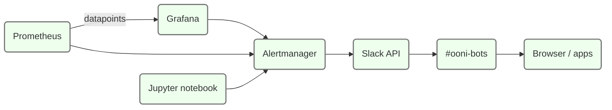

# Monitoring and Alerts

## Application metrics
  All components of the backend are designed to output application
  metrics.

  Metrics are prefixed with the name of each application. The metrics are
  used in [Grafana](#grafana)&thinsp;🔧 for charts, monitoring and alarming.

  They use the [StatsD](#statsd)&thinsp;💡 protocol.

  Application metrics data flow:

  

<!--
blockdiag {
 default_shape = roundedbox;
 Application [color = "#ffeeee"];
 Netdata [color = "#eeeeff", href = "@@netdata"];
 Prometheus [color = "#eeeeff", href = "@@prometheus"];
 Grafana [color = "#eeeeff", href = "@@grafana"];
 Application -> Netdata [label = "statsd"];
 Netdata -> Prometheus [label = "HTTPS"];
 Prometheus -> Grafana;
}
-->

  Ellipses represent data; rectangles represent processes. Purple
  components belong to the backend. Click on the image and then click on
  each shape to see related documentation.

  [Prometheus](#tool:prometheus) and [Grafana](#grafana)&thinsp;🔧 provide
  historical charts for more than 90 days and are useful to investigate
  long-term trends.

  [Netdata](#netdata)&thinsp;🔧 provides a web UI with real-time metrics. See
  the dedicated subchapter for details.


### StatsD
  All backend components send StatsD metrics over UDP using localhost as destination.

  This guarantees that applications never block on metric generation in
  case the receiver slows down. The StatsD messages are received by
  [Netdata](#netdata)&thinsp;🔧. It automatically tracks any new metric,
  generates averages and summaries as needed and exposes it to
  [Prometheus](#prometheus)&thinsp;🔧 for scraping.
  In the codebase the statsd library is often used as:

  ```python
  from <package_name>.metrics import setup_metrics
  setup_metrics(name="<component_name>")
  metrics.gauge("<metric_name>", <value>)
  ```

  Because of this, a quick way to identify where metrics are being generated
  in the backend codebase is to search e.g.:

  * <https://github.com/search?q=repo%3Aooni%2Fbackend+metrics.gauge&type=code>
  * <https://github.com/search?q=repo%3Aooni%2Fbackend+metrics.timer&type=code>

  Where possible, timers have the same name as the function being timed e.g.
  <https://github.com/search?q=repo%3Aooni%2Fbackend+clickhouse_upsert_summary&type=code>

  See [Conventions](#conventions)&thinsp;💡 for patterns around component naming.


#### Metrics list
  This subsection provides a list of the most important application metrics as they
  are shown in Grafana. The names are autogenerated by Netdata based on the
  metric name used in StatsD.

  For example a `@metrics.timer("generate_test_list")` Python decorator is used at:
  <https://github.com/ooni/backend/blob/0ec9fba0eb9c4c440dcb7456f2aab529561104ae/api/ooniapi/prio.py#L162>.
  Such timer will be processed by Netdata and appear in Grafana as:
  ```
  netdata_statsd_timer_ooni_api_generate_test_list_milliseconds_average
  ```

  The metrics always start with `netdata_statsd` and end with:

  * `_milliseconds_average`
  * `_events_persec_average`
  * `_value_average`

  Also see <https://blog.netdata.cloud/introduction-to-statsd/>

  TIP: StatsD collectors (like Netdata or others) preprocess datapoints by calculating average/min/max values etc.

  Run this to locate where in the backend codbase application metrics
  are being generated:

  ```bash
  find ~ -name '*.py' -exec grep 'metrics\.' -H "{}" \;
  ```

  Metrics for [ASN metadata updater](#asn-metadata-updater)&thinsp;⚙.
  See the [ASN metadata updater dashboard](#asn-metadata-updater-dashboard)&thinsp;📊:

```
netdata_statsd_asnmeta_updater_asnmeta_tmp_len_gauge_value_average
netdata_statsd_asnmeta_updater_asnmeta_update_progress_gauge_value_average
netdata_statsd_asnmeta_updater_fetch_data_timer_milliseconds_average
netdata_statsd_gauge_asnmeta_updater_asnmeta_tmp_len_value_average
netdata_statsd_gauge_asnmeta_updater_asnmeta_update_progress_value_average
netdata_statsd_timer_asnmeta_updater_fetch_data_milliseconds_average
```


Metrics for [CitizenLab test list updater](#citizenlab-test-list-updater)&thinsp;⚙

```
netdata_statsd_citizenlab_test_lists_updater_citizenlab_test_list_len_gauge_value_average
netdata_statsd_citizenlab_test_lists_updater_fetch_citizen_lab_lists_timer_milliseconds_average
netdata_statsd_citizenlab_test_lists_updater_update_citizenlab_table_timer_milliseconds_average
netdata_statsd_gauge_citizenlab_test_lists_updater_citizenlab_test_list_len_value_average
netdata_statsd_gauge_citizenlab_test_lists_updater_rowcount_value_average
netdata_statsd_timer_citizenlab_test_lists_updater_fetch_citizen_lab_lists_milliseconds_average
netdata_statsd_timer_citizenlab_test_lists_updater_rebuild_citizenlab_table_from_citizen_lab_lists_milliseconds_average
netdata_statsd_timer_citizenlab_test_lists_updater_update_citizenlab_table_milliseconds_average
```

Metrics for the [Database backup tool](#database-backup-tool)&thinsp;⚙.
See the [Database backup dashboard](#database-backup-dashboard)&thinsp;📊 on Grafana:

```
netdata_statsd_db_backup_run_export_timer_milliseconds_average
netdata_statsd_db_backup_status_gauge_value_average
netdata_statsd_db_backup_table_fastpath_backup_time_ms_gauge_value_average
netdata_statsd_db_backup_table_jsonl_backup_time_ms_gauge_value_average
netdata_statsd_db_backup_uploaded_bytes_tot_gauge_value_average
netdata_statsd_db_backup_upload_to_s3_timer_milliseconds_average
netdata_statsd_gauge_db_backup_status_value_average
netdata_statsd_gauge_db_backup_table_fastpath_backup_time_ms_value_average
netdata_statsd_gauge_db_backup_table_jsonl_backup_time_ms_value_average
netdata_statsd_gauge_db_backup_uploaded_bytes_tot_value_average
netdata_statsd_timer_db_backup_run_backup_milliseconds_average
netdata_statsd_timer_db_backup_run_export_milliseconds_average
netdata_statsd_timer_db_backup_upload_to_s3_milliseconds_average
netdata_statsd_gauge_db_backup_status_value_average
netdata_statsd_gauge_db_backup_table_citizenlab_byte_count_value_average
netdata_statsd_gauge_db_backup_table_fastpath_backup_time_ms_value_average
netdata_statsd_gauge_db_backup_table_fastpath_byte_count_value_average
netdata_statsd_gauge_db_backup_table_jsonl_backup_time_ms_value_average
netdata_statsd_gauge_db_backup_table_jsonl_byte_count_value_average
netdata_statsd_gauge_db_backup_uploaded_bytes_tot_value_average
netdata_statsd_timer_db_backup_backup_table_citizenlab_milliseconds_average
netdata_statsd_timer_db_backup_backup_table_fastpath_milliseconds_average
netdata_statsd_timer_db_backup_backup_table_jsonl_milliseconds_average
```


Metrics for the [social media blocking event detector](#social-media-blocking-event-detector)&thinsp;⚙:

```
netdata_statsd_gauge_detector_blocking_events_tblsize_value_average
netdata_statsd_gauge_detector_blocking_status_tblsize_value_average
netdata_statsd_timer_detector_run_detection_milliseconds_average
```


Metrics for the [Fastpath](#fastpath)&thinsp;⚙. Used in various dashboards,
primarily [API and fastpath](#api-and-fastpath)&thinsp;📊 dashboard.

```
netdata_statsd_timer_fastpath_db_clickhouse_upsert_summary_milliseconds_average
netdata_statsd_timer_fastpath_db_fetch_fingerprints_milliseconds_average
netdata_statsd_timer_fastpath_full_run_milliseconds_average
netdata_statsd_gauge_fastpath_recent_measurement_count_value_average
```


Metrics [Fingerprint updater](#fingerprint-updater)&thinsp;⚙
See the [Fingerprint updater dashboard](#fingerprint-updater-dashboard)&thinsp;📊 on Grafana.

```
netdata_statsd_timer_fingerprints_updater_fetch_csv_milliseconds_average
netdata_statsd_gauge_fingerprints_updater_fingerprints_dns_tmp_len_value_average
netdata_statsd_gauge_fingerprints_updater_fingerprints_http_tmp_len_value_average
netdata_statsd_gauge_fingerprints_updater_fingerprints_update_progress_value_average
```

Metrics from Nginx caching of the aggregation API.
See [Aggregation cache monitoring](#aggregation-cache-monitoring)&thinsp;🐍

```
netdata_statsd_gauge_nginx_aggregation_cache_EXPIRED_value_average
netdata_statsd_gauge_nginx_aggregation_cache_HIT_value_average
netdata_statsd_gauge_nginx_aggregation_cache_MISS_value_average
netdata_statsd_gauge_nginx_aggregation_cache_UPDATING_value_average
```

Metrics for the [API](#api)&thinsp;⚙.

```
netdata_statsd_counter_ooni_api_geoip_asn_differs_events_persec_average
netdata_statsd_counter_ooni_api_geoip_cc_differs_events_persec_average
netdata_statsd_counter_ooni_api_geoip_ipaddr_found_events_persec_average
netdata_statsd_counter_ooni_api_geoip_ipaddr_not_found_events_persec_average
netdata_statsd_counter_ooni_api_gunicorn_request_status_
netdata_statsd_counter_ooni_api_probe_cc_asn_match_events_persec_average
netdata_statsd_counter_ooni_api_probe_cc_asn_nomatch_events_persec_average
netdata_statsd_counter_ooni_api_probe_legacy_login_successful_events_persec_average
netdata_statsd_counter_ooni_api_probe_login_successful_events_persec_average
netdata_statsd_counter_ooni_api_receive_measurement_count_events_persec_average
netdata_statsd_counter_ooni_api_receive_measurement_discard_asn_
netdata_statsd_counter_ooni_api_receive_measurement_discard_cc_zz_events_persec_average
netdata_statsd_counter_ooni_api_uploader_msmt_count_events_persec_average
netdata_statsd_counter_ooni_api_uploader_postcan_count_events_persec_average
netdata_statsd_gauge_ooni_api_check_in_test_list_count_value_average
netdata_statsd_gauge_ooni_api_spool_post_count_value_average
netdata_statsd_gauge_ooni_api_test_list_urls_count_value_average
netdata_statsd_timer_ooni_api_apicall___api__v
netdata_statsd_timer_ooni_api_citizenlab_lock_time_milliseconds_average
netdata_statsd_timer_ooni_api_citizenlab_repo_init_milliseconds_average
netdata_statsd_timer_ooni_api_citizenlab_repo_pull_milliseconds_average
netdata_statsd_timer_ooni_api_fetch_citizenlab_data_milliseconds_average
netdata_statsd_timer_ooni_api_fetch_reactive_url_list_milliseconds_average
netdata_statsd_timer_ooni_api_generate_test_list_milliseconds_average
netdata_statsd_timer_ooni_api_get_aggregated_milliseconds_average
netdata_statsd_timer_ooni_api_get_measurement_meta_clickhouse_milliseconds_average
netdata_statsd_timer_ooni_api_get_measurement_meta_milliseconds_average
netdata_statsd_timer_ooni_api_get_raw_measurement_milliseconds_average
netdata_statsd_timer_ooni_api_get_torsf_stats_milliseconds_average
netdata_statsd_timer_ooni_api_gunicorn_request_duration_milliseconds_average
netdata_statsd_timer_ooni_api_open_report_milliseconds_average
netdata_statsd_timer_ooni_api_open_report_milliseconds_averageopen_report
netdata_statsd_timer_ooni_api_receive_measurement_milliseconds_average
netdata_statsd_timer_ooni_api_uploader_fill_jsonl_milliseconds_average
netdata_statsd_timer_ooni_api_uploader_fill_postcan_milliseconds_average
netdata_statsd_timer_ooni_api_uploader_total_run_time_milliseconds_average
netdata_statsd_timer_ooni_api_uploader_update_db_table_milliseconds_average
netdata_statsd_timer_ooni_api_uploader_upload_measurement_milliseconds_average
```

Metrics for the [GeoIP downloader](#geoip-downloader)&thinsp;⚙.

```
netdata_statsd_gauge_ooni_download_geoip_geoip_asn_epoch_value_average
netdata_statsd_gauge_ooni_download_geoip_geoip_asn_node_cnt_value_average
netdata_statsd_gauge_ooni_download_geoip_geoip_cc_epoch_value_average
netdata_statsd_gauge_ooni_download_geoip_geoip_cc_node_cnt_value_average
netdata_statsd_timer_ooni_download_geoip_download_geoip_milliseconds_average
```

Metrics for the [test helper rotation](#test-helper-rotation)&thinsp;⚙.

```
netdata_statsd_timer_rotation_create_le_do_ssl_cert_milliseconds_average
netdata_statsd_timer_rotation_deploy_ssl_cert_milliseconds_average
netdata_statsd_timer_rotation_destroy_drained_droplets_milliseconds_average
netdata_statsd_timer_rotation_end_to_end_test_milliseconds_average
netdata_statsd_timer_rotation_run_time_milliseconds_average
netdata_statsd_timer_rotation_scp_file_milliseconds_average
netdata_statsd_timer_rotation_setup_nginx_milliseconds_average
netdata_statsd_timer_rotation_setup_vector_milliseconds_average
netdata_statsd_timer_rotation_spawn_new_droplet_milliseconds_average
netdata_statsd_timer_rotation_ssh_reload_nginx_milliseconds_average
netdata_statsd_timer_rotation_ssh_restart_netdata_milliseconds_average
netdata_statsd_timer_rotation_ssh_restart_nginx_milliseconds_average
netdata_statsd_timer_rotation_ssh_restart_vector_milliseconds_average
netdata_statsd_timer_rotation_ssh_wait_droplet_warmup_milliseconds_average
netdata_statsd_timer_rotation_update_dns_records_milliseconds_average
```


### Prometheus
Prometheus <https://prometheus.io/> is a popular monitoring system and
runs on [monitoring.ooni.org](#monitoring.ooni.org)&thinsp;🖥

It is deployed and configured by [Ansible](#ansible)&thinsp;🔧 using the
following playbook:
<https://github.com/ooni/sysadmin/blob/master/ansible/deploy-monitoring.yml>

Most of the metrics are collected by scraping Prometheus endpoints,
Netdata, and using node exporter. The web UI is accessible at
<https://prometheus.ooni.org>

#### Blackbox exporter
Blackbox exporter is part of Prometheus. It's a daemon that performs HTTP
probing against other hosts without relying on local agents (hence the name Blackbox)
and feeds the generated datapoints into Promethous.

See <https://github.com/prometheus/blackbox_exporter>

It is deployed by
[Ansible](#tool:ansible) on the [monitoring.ooni.org](#monitoring.ooni.org)&thinsp;🖥

See
[Updating Blackbox Exporter runbook](#updating-blackbox-exporter-runbook)&thinsp;📒


### Grafana dashboards
There is a number of dashboards on [Grafana](#grafana)&thinsp;🔧 at
<https://grafana.ooni.org/>

[Grafana](#grafana)&thinsp;🔧 is deployed on the
[monitoring.ooni.org](#monitoring.ooni.org)&thinsp;🖥 host. See
[Monitoring deployment runbook](#monitoring-deployment-runbook)&thinsp;📒 for deployment.

The dashboards are used for:

 * Routinely reviewing the general health of the backend infrastructure

 * Predicting long-term scaling requirements, i.e.

 * increasing disk space for the database

 * increasing CPU and memory requirements

 * Investigating alerts and troubleshooting incidents


#### Alerting
Alerts from [Grafana](#tool:grafana) and [Prometheus](#prometheus)&thinsp;🔧
are sent to the [#ooni-bots](#topic:oonibots) [Slack](#slack)&thinsp;🔧
channel by a bot.

[Slack](#slack)&thinsp;🔧 can be configured to provide desktop notification
from browsers and audible notifications on smartphones.

Alert flow:


<!--
blockdiag {
 default_shape = roundedbox;
 Prometheus [color = "#eeeeff"];
 Grafana [color = "#eeeeff"];
 "#ooni-bots" [color = "#ffeeee"];
 Prometheus -> Grafana -> "Slack API" -> "#ooni-bots" -> "Slack app";
 "#ooni-bots" -> "Browser";
}
-->

The diagram does not explicitly include alertmanager. It is part of Prometheus and receives alerts and routes them to Slack.

More detailed diagram:



In the diagram Prometheus receives, stores and serves datapoints and has some alert rules to trigger alerts.
Grafana acts as a UI for Prometheus and also triggers alerts based on alert rules configured in Grafana itself.

Alertmanager is pretty simple - receives alerts and sends notification to Slack.

The alert rules are listed at <https://grafana.ooni.org/alerting/list>
The list also shows which alerts are firing at the moment, if any. There
is also a handful of alerts configured in [Prometheus](#prometheus)&thinsp;🔧
using [Ansible](#ansible)&thinsp;🔧.

The silences list shows if any alert has been temporarily silenced:
<https://grafana.ooni.org/alerting/silences>

See [Grafana editing](#grafana-editing)&thinsp;📒 and
[Managing Grafana alert rules](#managing-grafana-alert-rules)&thinsp;📒 for details.

There are also many dashboards and alerts configured in
[Jupyter Notebook](#jupyter-notebook)&thinsp;🔧. These are meant for metrics that require more
complex algorithms, predictions and SQL queries that cannot be
implemented using [Grafana](#grafana)&thinsp;🔧 e.g. when using machine learning or Pandas.
See [Ooniutils microlibrary](#ooniutils-microlibrary)&thinsp;💡 for details.

On many dashboards you can set the averaging timespan and the target
hostname using fields on the top left.

Here is an overview of the most useful dashboards:


#### API and fastpath
<https://grafana.ooni.org/d/l-MQSGonk/api-and-fastpath-multihost?orgId=1&var-avgspan=1h&var-host=backend-fsn.ooni.org>

This is the most important dashboard showing metrics of the
[API](#comp:api) and the [Fastpath](#fastpath)&thinsp;⚙.


#### Test-list repository in the API
<https://grafana.ooni.org/d/siWZslSVk/api-test-list-repo?orgId=1>

This dashboard shows timings around the git repository checked out by the
[API](#api)&thinsp;⚙ that contains the test lists.


#### Measurement uploader dashboard
<https://grafana.ooni.org/d/ma3Q6GzVz/api-uploader?orgId=1>

This dashboard shows metrics, timing and amounts of data transferred by the
[Measurement uploader](#measurement-uploader)&thinsp;⚙


#### Fingerprint updater dashboard
<https://grafana.ooni.org/d/JNlK8ox4z/fingerprints>

This dashboard shows metrics and timing from the
[Fingerprint updater](#fingerprint-updater)&thinsp;⚙


#### ClickHouse dashboard
<https://grafana.ooni.org/d/thEkJB_Mz/clickhouse?orgId=1>

This dashboards show ClickHouse-specific performance metrics.
It can be used for optimizations.

For investigating slow queries also see the [ClickHouse queries notebook](#clickhouse-queries-notebook)&thinsp;📔.


#### HaProxy dashboard
<https://grafana.ooni.org/d/ba33e4df-d686-4459-b37d-3966af14ad00/haproxy>

Basic metrics from [HaProxy](#haproxy)&thinsp;⚙ load balancers. Used for
[OONI bridges](#ooni-bridges)&thinsp;⚙.


#### TLS certificate dashboard
<https://grafana.ooni.org/d/-1mr7sWMk/ssl-certificates>

Certificate expiration times. There are alerts configured in
[Grafana](#grafana)&thinsp;🔧 to alert on expiring certificates.


#### Test helpers dashboard
<https://grafana.ooni.org/d/Dn1R7QEnz/test-helpers>

Status, uptime and load metrics from the
[Test helpers](#test-helpers)&thinsp;⚙.


#### Database backup dashboard
<https://grafana.ooni.org/d/aQjQYhoGz/db-backup>

Metrics, timing and data transferred by
[Database backup tool](#database-backup-tool)&thinsp;⚙

By looking at the last 24 hours of run you should be able to see the backup
being run
<https://grafana.ooni.org/d/aQjQYhoGz/db-backup?orgId=1&from=now-24h&to=now>

The "Status" chart shows the running status.
"Uploaded bytes in total" and "Backup time" should be self explanatory.

TIP: If the backup time or size grows too much it could be worth alerting and considering implementing incremental backups.


#### Event detector dashboard
<https://grafana.ooni.org/d/FH2TmwFVz/event-detection?orgId=1&refresh=1m>

Basic metrics from the
[social media blocking event detector](#social-media-blocking-event-detector)&thinsp;⚙


#### GeoIP MMDB database dashboard
<https://grafana.ooni.org/d/0e6eROj7z/geoip?orgId=1&from=now-7d&to=now>

Age and size of the GeoIP MMDB database. Also, a chart showing
discrepancies between the lookup performed by the probes VS the one in
the API, used to gauge the benefits of using a centralized solution.

Also see [Geolocation script](#geolocation-script)&thinsp;🐍

See [GeoIP downloader](#geoip-downloader)&thinsp;⚙


#### Host clock offset dashboard
<https://grafana.ooni.org/d/9dLa-RSnk/host-clock-offset?orgId=1>

Measures NTP clock sync and alarms on big offsets


#### Netdata-specific dashboard
<https://grafana.ooni.org/d/M1rOa7CWz/netdata?orgId=1&var-instance=backend-fsn.ooni.org:19999>

Shows all the metrics captured by [Netdata](#netdata)&thinsp;🔧 - useful for
in-depth performance investigation.


#### ASN metadata updater dashboard
<https://grafana.ooni.org/d/XRihZL-Vk/ansmeta-update?orgId=1&from=now-7d>

Progress, runtime and table size of the [ASN metadata updater](#asn-metadata-updater)&thinsp;⚙

See [Metrics list](#metrics-list)&thinsp;💡


### Netdata
Netdata <https://www.netdata.cloud/> is a monitoring agent that runs
locally on the backend servers. It exports host and
[Application metrics](#topic:appmetrics) to [Prometheus](#prometheus)&thinsp;🔧.

It also provides a web UI that can be accessed on port 19999. It can be
useful during development, performance optimization and debugging as it
provides metrics with higher time granularity (1 second) and almost no
delay.

Netdata is not exposed on the Internet for security reasons and can be
accessed only when nededed by setting up port forwarding using SSH. For
example:

```bash
ssh ams-pg-test.ooni.org -L 19998:127.0.0.1:19999
```

Netdata can also be run on a development desktop and be accessed locally
in order to explore application metrics without having to deploy
[Prometheus](#tool:prometheus) and [Grafana](#grafana)&thinsp;🔧.

See [Netdata-specific dashboard](#netdata-specific-dashboard)&thinsp;📊 of an example of native
Netdata metrics.


## Log management
All components of the backend are designed to output logs to Systemd's
journald. They usually log using the component name as Systemd unit
name.

Sometimes you might have to use `--identifier <name>` instead for
scripts that are not run as Systemd units.

Journald automatically indexes logs by time, unit name and other items.
This allows to quickly filter logs during troubleshooting, for example:

```bash
sudo journalctl -u ooni-api --since '10 m ago'
```

Or follow live logs using e.g.:

```bash
sudo journalctl -u nginx -f
```

Sometimes it is useful to show milliseconds in the timestamps:

```bash
sudo journalctl -f -u ooni-api -o short-precise
```

The logger used in Python components also sets additional fields,
notably CODE_FUNC and CODE_LINE

Available fields can be listed using:

```bash
sudo journalctl -f -u ooni-api  -N | sort
```

It is possible to filter by those fields. It comes very handy for
debugging e.g.:

```bash
sudo journalctl -f -u ooni-api CODE_FUNC=open_report
```

Every host running backend services also sends host to
monitoring.ooni.org using [Vector](#vector)&thinsp;🔧.


<!--
blockdiag {
 default_shape = roundedbox;
 Application -> Vector-sender -> Vector-receiver -> ClickHouse;
 Application [color = "#ffeeee"];
 Vector-sender [color = "#eeeeff", href= = "@@vector"];
 Vector-receiver [color = "#eeeeff", href= = "@@vector"];
 ClickHouse [color = "#eeeeff", href= = "@@clickhouse"];

 group {
    Application; Vector-sender;
 }

 group {
    Vector-receiver -> ClickHouse;
    label = "monitoring.ooni.org";
    color = "#77FF77";
 }
}
-->
There is a dedicated ClickHouse instance on monitoring.ooni.org used to
collect logs. See the [ClickHouse instance for logs](#clickhouse-instance-for-logs)&thinsp;⚙.
This is done to avoid adding unnecessary load to the production database
on FSN that contains measurements and also keep a copy of FSN's logs on
a different host.

The receiving [Vector](#vector)&thinsp;🔧 instance and ClickHouse are
deployed and configured by [Ansible](#ansible)&thinsp;🔧 using the following
playbook:
<https://github.com/ooni/sysadmin/blob/master/ansible/deploy-monitoring.yml>

See [Logs from FSN notebook](#logs-from-fsn-notebook)&thinsp;📔 and
[Logs investigation notebook](#logs-investigation-notebook)&thinsp;📔


### Slack
[Slack](https://slack.com/) is used for team messaging and automated
alerts at the following instance: <https://openobservatory.slack.com/>


#### #ooni-bots
`#ooni-bots` is a [Slack](#slack)&thinsp;🔧 channel used for automated
alerts: <https://app.slack.com/client/T37Q8EGUU/C38EJ0CET>
